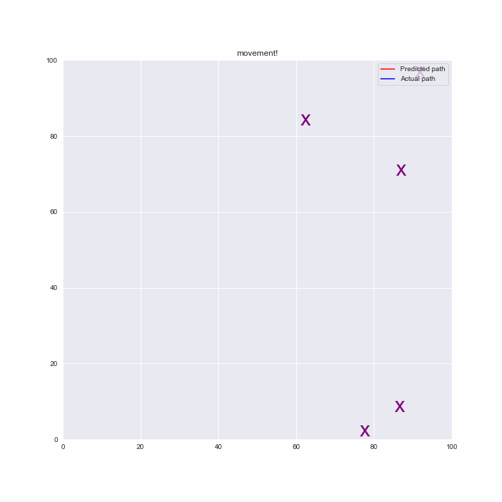

# Udacity-CVND-P3-SLAM
For this project, I have implemented SLAM and online SLAM for a robot that moves in a 2D world.

# The Problem

# Implementation Details
SLAM uses 2 matrices Omega and Xi which are updated with the robots movement and distance from landmark at each step. 
1. The details of the robots movement and landmarks distance are fed to the algorithm.
2. The function iterates through every entry and updates the matrices as in the algorithm

### Online SLAM
Online SLAM is a better version that the original one, since the matrix size doesnt grow with the number of robot motions.
1. It considers one motion at a time and updates the matrices.
2. The matrices are then put through an operation to reduce the size to the original size while at the same time not losing the information from the prev update.
3. Online slam has the same final values for the estiamated robot's position and positions of the landmarks

# Result
As you can see in the gif below, the Predicted path keeps up with the Actual path and does a good job at that. 

